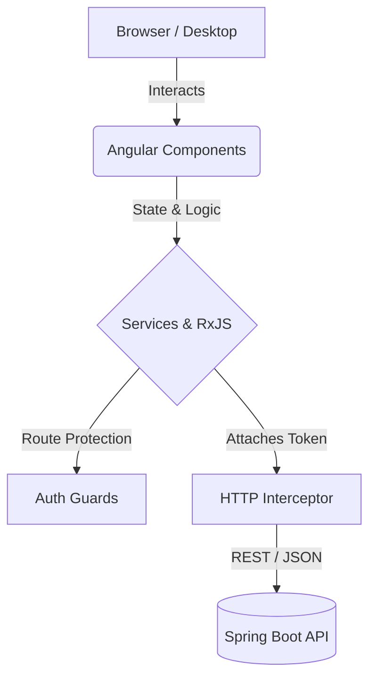

# 💻 Journey Web Client | Enterprise Inventory Dashboard


The official desktop web application for the Journey clothing brand. Built with **Angular**, this administrative dashboard provides a comprehensive, high-level view of the entire inventory ecosystem. It is designed for back-office management, allowing administrators and managers to track stock, oversee employee activities, and analyze the audit trail with a mouse-and-keyboard optimized interface.

> ⚙️ **Looking for the Core API?**
> 
> This repository contains the client-side web application. The robust Java Spring Boot backend that powers this dashboard can be found here: **[CLICK HERE TO ACCESS THE BACKEND REPOSITORY](https://github.com/FeltrinLM/journey_backend)**.

---

## 📸 Application in Action

https://github.com/user-attachments/assets/7ec641f5-17b4-437f-bd4b-46abf0fd41e5

---

## 🎯 Business Value & Core Mechanics

While the mobile application serves the warehouse floor, the Web Client is the command center. It leverages the desktop environment to present dense data (like audit logs and large inventory tables) clearly and efficiently.

### Key System Behaviors:
* **Admin-Centric Dashboard:** Tailored views for data-heavy operations. The desktop layout utilizes wider screen real estate for complex data tables, pagination, and dynamic filtering.
* **Role-Based Access Control (RBAC) UI:** The interface dynamically adapts based on the authenticated user's JWT payload. 
  * `ADMINISTRATORS` have access to user management, system configurations, and full history logs.
  * `EMPLOYEES` are restricted to standard inventory updates and viewing modules.
* **Seamless Security Integration:** Custom HTTP Interceptors automatically attach authentication tokens to every outgoing request and elegantly handle session timeouts or unauthorized access attempts.

## 🏗️ Software Architecture

The application is a Single Page Application (SPA) utilizing Angular's robust component-based architecture and reactive programming principles.



### Design Patterns & Best Practices
* **Component Modularity:** Strict separation of Smart (Container) and Dumb (Presentational) components for maintainable and reusable UI elements.
* **Reactive State Management:** Utilizing RxJS Observables to handle asynchronous data streams, ensuring the UI remains perfectly synchronized with backend responses and loading states.
* **Service-Oriented Architecture:** API calls and business logic are heavily isolated within Angular Services, keeping components lightweight and focused purely on the view.

## 🚀 How to Run Locally

### Prerequisites
* [Node.js](https://nodejs.org/) (v16+ recommended)
* Angular CLI (`npm install -g @angular/cli`)
* The Journey Backend API running locally (`http://localhost:8080`)

### Setup
1. Clone the repository:
   ```bash
   git clone https://github.com/FeltrinLM/JourneyFront-end.git
   ```
2. Navigate to the project directory and install dependencies:
   ```bash
   cd JourneyFront-end
   npm install
   ```
3. Run the development server:
   ```bash
   ng serve
   ```
4. Navigate to `http://localhost:4200/` in your browser. The app will automatically reload if you change any of the source files.

---
*Command and control for the modern supply chain.*
